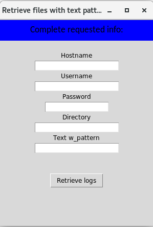

# logretriever

This project allows to retrieve files from a remote server.
It uses SSH to login and retrieve files than includes a text pattern and are located in a specific directory.

## How to install

1. Clone this repository in your working computer.

1. It is recommended to create an virtual environment.

    ```bash
    python3 -m venv .venv
    ```

    login into the virtual environment

    ```bash
    source .venv/bin/activate
    ```

1. Install requirements

    ```bash
    pip install -r requirements.txt
    ```

1. Optionally you can preload some of the text entries. Check *__init.py__* file to learn how to do this.

1. You can run the code like this:

    ```bash
    python3 -m logretriever
    ```

1. This is a sample of the screen



1. To exit the virtual environment just run

```bash
deactivate
```

